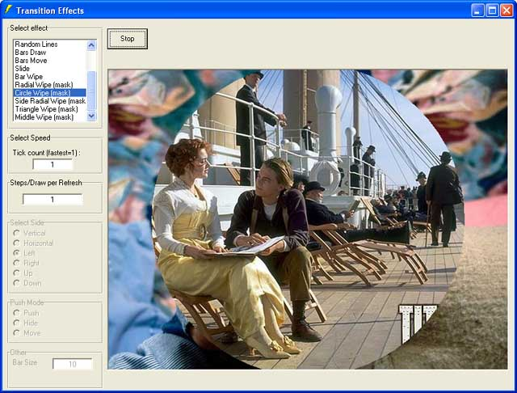



## Transition Effects 3\.5 \(15 effects, fast ,customizable,circle wipe,radial wipe,\.\.\.\) must see it

### Description

15 nice,fast,customizable effects.

best for slide show, u can use them in ur programs.

download it,run,enjoy,feedback,vote and use ;)

wipe in,wipe out,stretch wipe, radial wipe,circle wipe,triangle wipe,random lines,3 kind of bars and ....
 
### More Info
 

             |
---                |---
**Submitted On**   |2002-07-23 12:13:32
**By**             |[ali s](https://github.com/Planet-Source-Code/PSCIndex/blob/master/ByAuthor/ali-s.md)
**Level**          |Advanced
**User Rating**    |5.0 (45 globes from 9 users)
**Compatibility**  |VB 5\.0, VB 6\.0
**Category**       |[Graphics](https://github.com/Planet-Source-Code/PSCIndex/blob/master/ByCategory/graphics__1-46.md)
**World**          |[Visual Basic](https://github.com/Planet-Source-Code/PSCIndex/blob/master/ByWorld/visual-basic.md)
**Archive File**   |[Transition1094717232002\.zip](https://github.com/Planet-Source-Code/ali-s-transition-effects-3-5-15-effects-fast-customizable-circle-wipe-radial-wipe-must-see__1-37177/archive/master.zip)

